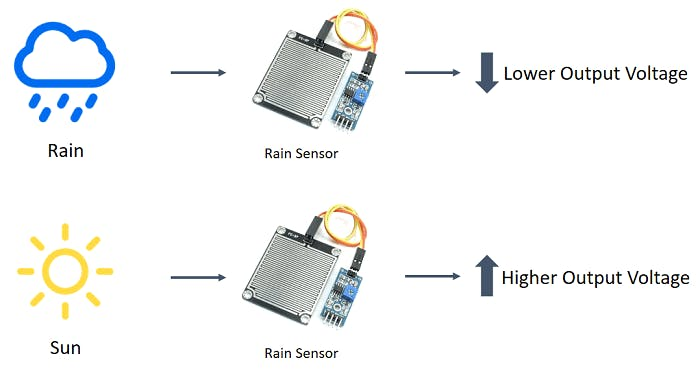
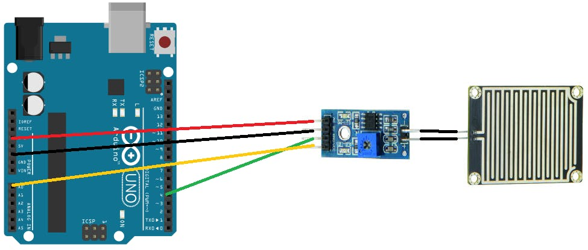
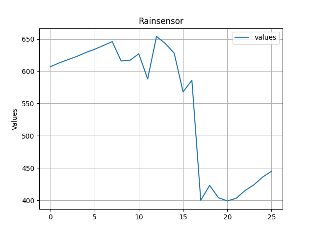

<!--https://create.arduino.cc/projecthub/MisterBotBreak/how-to-use-a-rain-sensor-bcecd9-->

# Rain-Sensor

A rain sensor is composed of a rain detection plate with a comparator who manages intelligence. The rain sensor detects water that comes short circuiting the tape of the printed circuits.

The sensor acts as a variable resistance that will change status : the resistance increases when the sensor is wet and the resistance is lower when the sensor is dry.

The comparator has 2 outputs connected to the rain sensor, a digital output (0/1) and an analog output (0 to 1023).

## Connections

- Arduino &rarr; Comparator
- 5V &rarr; VCC
- GND &rarr; GND
- DO &rarr; D4
- AO &rarr; A0

### Adjust the sensitivity

You can also adjust the sensitivity by turning the potentiometer present on the comparator. So the detection can be realize on a drop or in a glass of water.

## Plotter

## Contribute

Feel free to contribute in the style of an inner-source project. You can also log issues if you find wrong/ missing functionalities. Contact the maintainer of this project if questions appear.

## Feedback

If you find any bug or have any suggestion, please do file issues. I am graceful for any feedback and will do my best to improve this package.

## License

[MIT](LICENSE) © 2020 Ioannis Christodoulakis
